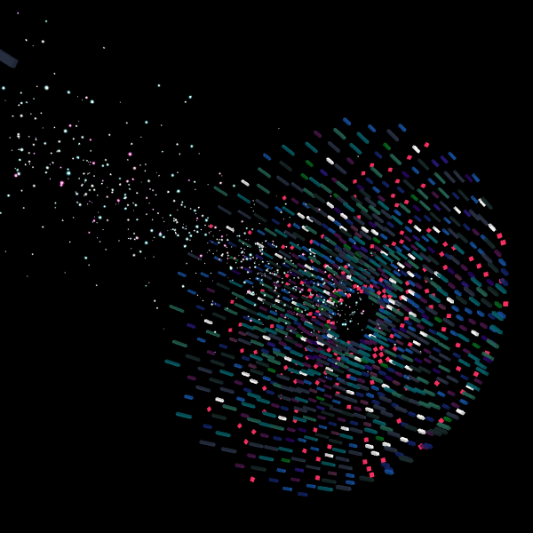

# AP Research Project
2023-24 AP Research Project - (QC)osmic: Creating Visual Art With a Quantum Computer

The field of quantum computing (QC), which manipulates quantum mechanical phenomena to perform computations, has received much attention due to its prospective revolutionary impacts on technology. In recent years, increased access to QC has led to the emergence of a new art form that uses QC as an artistic medium. This research project adopts a creative approach to contribute to the sparse discussion on using QC to explore visual art, or "quantum generative art," as well as its capabilities to promote understanding through metaphorical representations, data visualization, and skill development opportunities. The final artwork, (QC)osmic, is an interactive three-dimensional structure that incorporates data from IBM quantum systems. To promote understanding, (QC)osmic alludes to and utilizes concepts such as nondeterminism and quantum noise. Additionally, despite barriers, creating quantum generative art allows for the experimentation and application of QC fundamentals without requiring a heavy scientific background. Though conclusions rely on the researcher's interpretations of their creative process and artwork, (QC)osmic serves as a proof-of-concept for quantum generative art and its potential to promote broader understandings of this powerful emerging technology.

- [Live p5.js sketch](https://editor.p5js.org/emeraldblackbird/sketches/JFyzTBAZt)

- [Old projects/versions that led to the final project](https://editor.p5js.org/emeraldblackbird/collections/Yu34_iAF6) (I have included some of these in the Previous Attempts Folder)

- [Instagram Post](https://www.instagram.com/p/C6GhoLJOsSK/?utm_source=ig_web_button_share_sheet&igsh=MzRlODBiNWFlZA==) (When the background is not redrawn between successive frames: As the user rotates, zooms, and moves around the camera, the frames are drawn on top of each other. The artwork is then a result of the user interacting with the structure--this can be thought of as a metaphor for measurement, since the act of observing a qubit changes its state.)

## Gallery

- 
- 
- 
- 
- 
- 
- 
- 
- 
- 
